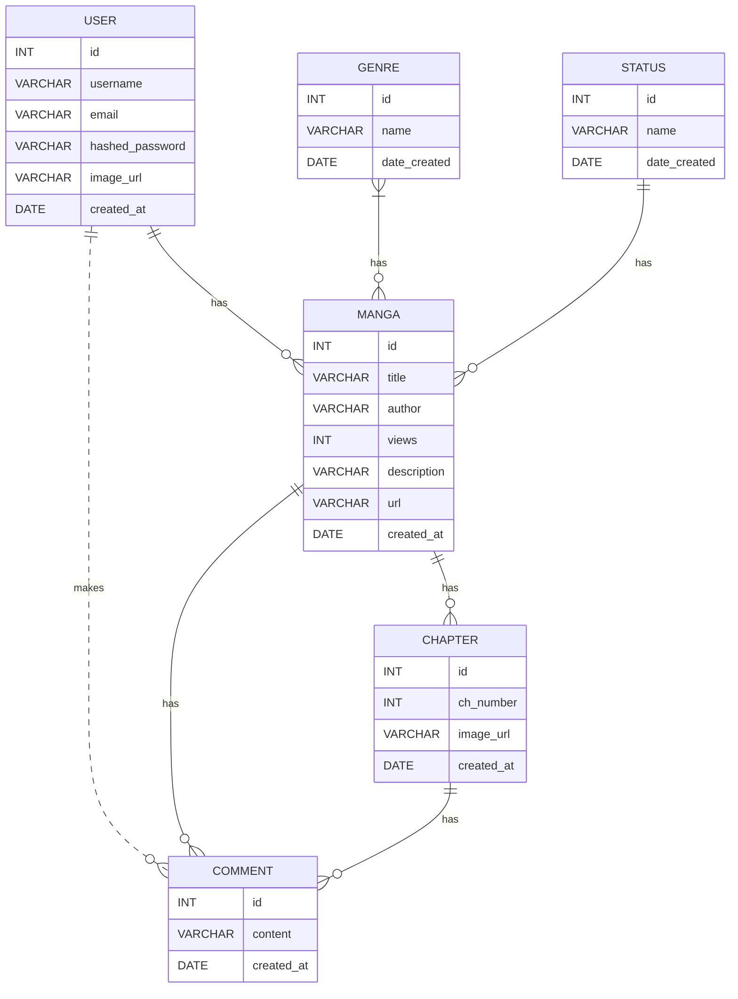

# Modelo de Dados

### Modelo Entidade-Relacionamento

```mermaid
erDiagram
    USER ||..o{ COMMENT : makes
    USER ||--o{ MANGA : has
    MANGA ||--o{ CHAPTER : has
    MANGA ||--o{ COMMENT : has
    CHAPTER ||--o{ COMMENT : has
    GENRE |{--o{  MANGA: has
    STATUS ||--o{ MANGA: has

    USER{
        INT id
        VARCHAR  username
        VARCHAR  email
        VARCHAR  hashed_password
        VARCHAR  image_url
        DATE created_at
    }

    COMMENT{
        INT id
        VARCHAR content
        DATE created_at
    }

    MANGA{
        INT id
        VARCHAR title
        VARCHAR author
        INT views
        VARCHAR description
        VARCHAR url
        DATE created_at
    }

    CHAPTER{
        INT id
        INT ch_number
        VARCHAR image_url
        DATE created_at
    }

    GENRE{
        INT id
        VARCHAR name
        DATE date_created
    }

    STATUS{
        INT id
        VARCHAR name
        DATE date_created
    }
```
